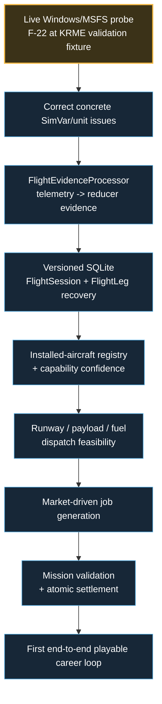

# OpenCareer master development checklist

Status: living project tracker.  
Last reconciled: 2026-09-18 on `feature/economy-ownership` after verified economy/ownership core implementation. The strict chapter tracker remains more granular than the visual roadmap.

This is the master checklist for OpenCareer development. It is intentionally stricter than a feature wish list: an item is checked only when the implementation exists and the stated verification has actually been performed.

## How this stays live

Whenever a development change materially changes project status:

1. Update this checklist in the same branch/commit or immediately following documentation commit.
2. Update `docs/project-state.md` when the handoff/next bounded work changes.
3. Keep `ASTRA.md` short; it links here rather than duplicating the full tracker.
4. Never mark a live-MSFS acceptance item complete from mocks, synthetic traces, compilation or CI alone.
5. Never mark a gameplay system complete because its design document exists.
6. Preserve the existing chapter order unless an explicit project decision changes it.

Status words used in the graphics:

- **COMPLETE** — implementation and its stated verification are done.
- **ACTIVE** — useful implementation exists, but the chapter/track exit gate is not met.
- **GATED** — work is intentionally waiting on a prerequisite or real-world validation.
- **PLANNED** — accepted scope with no qualifying implementation yet.

## Development path

## Current critical path

---

# Chapter 1 — Project continuity and working rules

Chapter status: **COMPLETE**

- [x] Create canonical `AGENTS.md`.
- [x] Create ultra-fast `ASTRA.md` resume file.
- [x] Maintain detailed `docs/project-state.md`.
- [x] Establish feature-branch + draft-PR workflow.
- [x] Establish deterministic domain test foundation.
- [x] Establish chapter-based development workflow.
- [x] Create this master development tracker.
- [x] Preserve fixed architecture decisions: C#/.NET 10, WinUI 3, SimConnect boundary, SQLite, offline-first core.
- [x] Keep F-22/KRME explicitly documented as a developer validation fixture rather than a career-start asset.

Exit gate: repository documentation alone is sufficient for a fresh development chat to identify branch, architecture, implemented foundation, hard gates and next bounded work.

---

# Chapter 2 — Windows application shell

Chapter status: **ACTIVE**

## Implemented

- [x] Create `OpenCareer.App` with .NET 10 / WinUI 3 / Windows x64.
- [x] Add left `NavigationView` shell.
- [x] Add Dashboard page.
- [x] Add Current Flight page.
- [x] Add safe placeholders for later sections.
- [x] Separate Views/ViewModels from simulator/domain services.
- [x] Add application startup DI/logging foundation.
- [x] Display disconnected/waiting state without blocking the UI.
- [x] Display normalized live telemetry when supplied by the simulator service.
- [x] Ensure telemetry/connection state alone does not create a `FlightSession`.
- [x] Add Windows CI build for the WinUI app.

## Remaining

- [ ] Launch and inspect the production app locally on the user's Windows machine with MSFS closed.
- [ ] Verify NavigationView interaction locally.
- [ ] Verify resize/adaptive behavior on practical desktop window widths.
- [ ] Verify startup/shutdown behavior with the native SimConnect DLL present.
- [ ] Replace later placeholders only when their backing application/domain systems exist.

Exit gate: Windows launch/navigation/disconnected state verified locally; no startup crash.

---

# Chapter 3 — Simulator connection and normalized telemetry

Chapter status: **GATED — implementation exists, live runtime acceptance is open**

## Implemented

- [x] Create mockable `ISimulatorConnection` boundary.
- [x] Create mockable `ISimulatorTelemetrySource` boundary.
- [x] Isolate SDK/native calls in `OpenCareer.SimConnect`.
- [x] Serialize native SimConnect ownership on one worker.
- [x] Implement connect/disconnect handling.
- [x] Implement bounded retry/reconnect behavior.
- [x] Implement liveness checking.
- [x] Prevent false Connected state when SimConnect setup fails.
- [x] Normalize initial ~1 Hz telemetry.
- [x] Normalize latitude/longitude.
- [x] Normalize MSL/AGL altitude.
- [x] Normalize IAS / ground speed.
- [x] Normalize vertical speed.
- [x] Normalize heading.
- [x] Normalize pitch/bank/G.
- [x] Normalize on-ground / parking brake.
- [x] Normalize engine state.
- [x] Normalize fuel and conservative derived payload.
- [x] Normalize flaps / gear.
- [x] Normalize pause / slew.
- [x] Clear stale telemetry after the simulator connection/session ends.
- [x] Add raw callback / mapping / malformed packet tests.
- [x] Add Windows live-probe executable.
- [x] Add offline JSONL trace analyzer.
- [x] Add synthetic trace-analyzer tests.

## Remaining / live gate

- [ ] Run `./tools/run-live-probe.ps1` with MSFS 2024 on the user's Windows machine.
- [ ] Verify simulator absent -> Waiting/Disconnected.
- [ ] Verify native connection to MSFS 2024.
- [ ] Verify actual installed aircraft identity behavior.
- [ ] Verify ~1 Hz values against the F-22/KRME validation flight.
- [ ] Verify pause / resume.
- [ ] Verify menus/loading behavior.
- [ ] Verify taxi values.
- [ ] Verify takeoff values.
- [ ] Verify climb/cruise values.
- [ ] Verify approach/landing values.
- [ ] Verify normal simulator quit.
- [ ] Verify abrupt simulator exit.
- [ ] Verify telemetry clearing after disconnect.
- [ ] Verify reconnect after MSFS restart.
- [ ] Correct any real SimVar/unit discrepancy found by the live trace.
- [ ] Add verified simulation-rate capture.
- [ ] Add verified aircraft identity/title/type fields needed by the flight/session system.
- [ ] Add bounded/adaptive telemetry sampling needed for landing detection/scoring.

Exit gate: live Windows/MSFS connect-disconnect-reconnect and telemetry behavior demonstrated; missing-value handling remains covered by automated tests.

---

# Chapter 4 — Flight detection, time accounting and durable recovery

Chapter status: **ACTIVE FOUNDATION / GATED FOR CALIBRATION**

## Implemented foundation

- [x] Define accepted flight-session semantics in `docs/flight-session-design.md`.
- [x] Implement pure `FlightTrackingStateMachine` reducer foundation.
- [x] Keep raw SimConnect thresholds out of the pure reducer.
- [x] Implement `FlightTimeLedger`.
- [x] Separate simulated, block/movement, airborne and career-credit time concepts.
- [x] Account for pause/slew in the time model.
- [x] Define simulation-rate career-credit anti-exploit rule.
- [x] Define multi-leg `FlightSession` / `FlightLeg` behavior.
- [x] Define bounce/recontact vs new landing episode.
- [x] Define touch-and-go separately from full-stop.
- [x] Define rejected-takeoff behavior.
- [x] Define safe diversion/go-around semantics.
- [x] Define conventional park/shutdown/servicing terminal policy.
- [x] Add deterministic unit tests for the pure flight-core foundation.
- [x] Add offline trace analysis to support threshold calibration.

## Remaining

- [ ] Implement configurable `FlightEvidenceProcessor` from normalized telemetry/events.
- [ ] Calibrate speed/AGL/timing/hysteresis thresholds from real MSFS traces.
- [ ] Detect stable load/observation start.
- [ ] Detect self-powered movement / flight-time start.
- [ ] Detect taxi-out.
- [ ] Detect takeoff roll.
- [ ] Detect rejected takeoff.
- [ ] Detect sustained airborne state.
- [ ] Detect approach/landing episode.
- [ ] Detect bounce/recontact without duplicate landing.
- [ ] Detect go-around/new approach.
- [ ] Detect taxi-in.
- [ ] Detect parking/shutdown terminal conditions.
- [ ] Handle aircraft change safely.
- [ ] Handle material slew/teleport evidence.
- [ ] Handle disconnect suspension and plausible resume.
- [ ] Create authoritative runtime `FlightSession` orchestration.
- [ ] Create versioned SQLite schema for FlightSession/FlightLeg.
- [ ] Add atomic/checkpoint persistence.
- [ ] Add previous-valid-save/recovery strategy.
- [ ] Prevent duplicate milestones/rewards after resume.
- [ ] Persist decimated route track plus event windows.
- [ ] Verify recovery after app restart.
- [ ] Verify recovery after simulator disconnect/restart.
- [ ] Verify representative 1-, 3- and 6-hour replay scenarios.
- [ ] Verify at least one complete live takeoff-to-park/shutdown session.

Exit gate: a real session can be tracked, saved, interrupted, recovered and completed without duplicate effects.

---

# Chapter 5 — Installed-aircraft registry and feasible dispatch

Chapter status: **PLANNED, with domain capability foundations**

## Existing foundation

- [x] Establish capability-based eligibility direction; no small static supported-aircraft whitelist.
- [x] Define separate concepts for civilian ownership, rental/employer access and military assignment.
- [x] Establish performance-source/confidence policy.
- [x] Establish runway/performance feasibility requirement.

## Remaining

- [ ] Detect/index installed aircraft.
- [ ] Persist installed-aircraft registry.
- [ ] Normalize aircraft identity/family/type.
- [ ] Infer/store capability profiles.
- [ ] Record source/confidence per important capability.
- [ ] Resolve selected aircraft access type.
- [ ] Read/use simulator scenery/facility runway data where practical.
- [ ] Build airport/runway candidate model.
- [ ] Validate payload/weight.
- [ ] Validate fuel/endurance/range.
- [ ] Validate takeoff runway feasibility.
- [ ] Validate landing runway feasibility.
- [ ] Apply safety margins.
- [ ] Include weather/environment inputs where authoritative data exists.
- [ ] Reject unknown-critical-performance cases with explicit reason.
- [ ] Ensure military assignment eligibility cannot imply civilian ownership.
- [ ] Add deterministic capability/dispatch tests.

Exit gate: impossible or unknown-critical jobs are rejected before acceptance; feasible routes explain why they pass.

---

# Chapter 6 — Home airport, employment and first playable mission loop

Chapter status: **PLANNED, with contract/location foundations**

## Existing foundation

- [x] Create structured contract lifecycle foundation.
- [x] Add location/home-base connection rules.
- [x] Add travel-history guards.
- [x] Add typical session-duration preferences.
- [x] Define no-teleport company geography.
- [x] Define fresh-career start with no required owned aircraft.
- [x] Define employer/rental/assigned-aircraft path.

## Remaining

- [ ] Create player career onboarding.
- [ ] Home-airport selection.
- [ ] Persist player location/home base.
- [ ] Build market-driven job generation.
- [ ] Filter jobs through aircraft/runway/qualification feasibility.
- [ ] Build briefing flow.
- [ ] Build dispatch-to-active-mission flow.
- [ ] Bind mission evidence to FlightSession.
- [ ] Implement mission-specific objective validation.
- [ ] Require mission terminal conditions beyond landing.
- [ ] Build result/debrief flow.
- [ ] Add logbook commit flow.
- [ ] Atomically settle money once.
- [ ] Atomically settle reputation/relationships once.
- [ ] Atomically settle travel/location once.
- [ ] Prevent duplicate settlement.
- [ ] Keep employee work viable without company ownership.
- [ ] Add first representative passenger/cargo/utility job.
- [ ] Add first end-to-end playable KRME-area career operation.

Exit gate: accept -> dispatch -> fly -> validate -> park/shutdown -> settle once -> reload.

---

# Chapter 7 — Persistent economy, named cargo, absence and recovery

Chapter status: **ACTIVE FOUNDATION**

## Implemented foundation

- [x] Deterministic world/economy simulation foundation.
- [x] Persistent market-state model.
- [x] Event/replay/checkpoint foundation.
- [x] Contract/economy invariants.
- [x] Protected-absence policy foundation.
- [x] Bankruptcy-stage/recovery policy foundation.
- [x] Session preference policy.
- [x] Bounded manual-ground reward quote model.
- [x] Define named-commodity cargo requirements.
- [x] Implement data-driven named commodity catalog with coffee, phones, televisions, fresh food and live plants.
- [x] Implement deterministic airport/region commodity market snapshots.
- [x] Implement immutable commodity-lot value snapshots.
- [x] Implement deterministic freight quoting separate from cargo value.
- [x] Separate freight compensation from cargo value.
- [x] Define temporary shock vs structural-capacity distinction.

## Remaining

- [ ] Persist authoritative world/economy state in production SQLite.
- [ ] Connect world state to live job generation.
- [ ] Connect fuel/service/MRO/labor pressure to operating costs.
- [ ] Bind immutable accepted cargo manifests into authoritative FlightSession/job settlement.
- [ ] Generate cargo jobs from supply/demand/event state.
- [ ] Implement cargo condition/outcome evidence only where supported.
- [ ] Settle cargo freight/penalties atomically.
- [ ] Implement long-absence advancement in authoritative career state.
- [ ] Verify no duplicate payments/debt effects after reload.
- [ ] Implement recoverable bankruptcy execution.
- [ ] Keep employee path available after financial failure.
- [ ] Balance world dynamics through deterministic simulations.

Exit gate: persistent world affects jobs/costs coherently and survives long absence/reload without duplicate effects.

---

# Chapter 8 — Credit, dealers, ownership and storage

Chapter status: **ACTIVE FOUNDATION**

## Implemented core

- [x] Career-derived credit model.
- [x] Fictional lender model.
- [x] Affordability/debt-service checks.
- [x] Fictional aircraft dealer model.
- [x] Seeded dealer offers/discounts.
- [x] Dealer stock validation.
- [x] Cash/finance eligibility quote foundation.
- [x] Define 50–80 real-flight-hour ownership balancing target without hard unlock.
- [x] Separate access/assignment from ownership.
- [x] Persist dealer inventory, issued offers and used-aircraft condition in SQLite.
- [x] Atomically consume dealer stock.
- [x] Atomically debit cash/deposit plus initial storage/insurance costs.
- [x] Originate persistent aircraft loans.
- [x] Persist deterministic amortization schedules.
- [x] Transfer aircraft ownership atomically.
- [x] Prevent duplicate purchase/loan creation with idempotent operation IDs.
- [x] Roll back money/stock/storage when a purchase fails.
- [x] Implement insurance policy persistence and policy-dependent one-redo-per-real-day rule.
- [x] Implement hangar/storage availability, first-period cost and slot occupancy.
- [x] Persist ownership/loan/insurance/storage state across reload.
- [x] Add deterministic next-cycle ownership cost quotes for active loan/insurance/storage state without performing settlement.

## Remaining / downstream integration

- [ ] Persist mutable lender-market/profile state if lender terms become dynamic rather than configured profiles.
- [ ] Add lender comparison UI.
- [ ] Add dealer/aircraft purchase UI.
- [ ] Implement actual scheduled loan-payment execution and default/restructuring orchestration.
- [ ] Implement delivery/reposition logistics beyond assigning the purchased aircraft to its accepted storage airport.
- [ ] Balance ownership pacing using settled career income/costs.

Exit gate: cash and financed aircraft purchases survive reload and cannot duplicate stock, money or loans.

---

# Chapter 9 — Maintenance, company growth, bases and route expansion

Chapter status: **ACTIVE CORE**

- [x] Persist gradual wear separately from discrete damage.
- [ ] Use verified simulator wear/component state only where available.
- [x] Add conservative OpenCareer fallback maintenance/reliability state with explicit confidence.
- [x] Implement deterministic inspection/service schedules.
- [x] Implement maintenance cost and downtime quotes.
- [ ] Implement MRO/parts availability.
- [x] Implement persistent maintenance history with idempotent event IDs.
- [x] Implement hard-landing, overspeed, engine-stress and excess-G wear/damage inputs.
- [ ] Connect those abuse inputs to verified live FlightSession telemetry evidence.
- [ ] Keep routine management automated by default.
- [ ] Implement evidence-backed manual-ground actions with bounded one-time rewards.
- [ ] Persist airport relationships.
- [ ] Persist hangar/storage inventory.
- [ ] Implement additional bases.
- [ ] Implement route/network relationships.
- [ ] Add NPC employee/crew foundation.
- [ ] Prevent uncontrolled offline borrowing/spending.
- [ ] Expose operating margins/risks before expansion.

Exit gate: maintenance, staffing, facilities and geography affect availability/profit without bypassing safety or persistence rules.

---

# Chapter 10 — Military/government careers, simulated conflict and special events

Chapter status: **ACTIVE DESIGN / PLANNED IMPLEMENTATION**

## Completed design/foundation

- [x] Keep government/military access distinct from ownership.
- [x] Define military-heavy airport weighting without inventing undocumented real operations.
- [x] Preserve KRME's civilian/government/defense-support/UAS character.
- [x] Define military/government UI destination.
- [x] Define Conflict Operations visual design.
- [x] Define fundamental combat boundary: MSFS supplies flight telemetry; OpenCareer simulates all combat/threat/damage/world effects.
- [x] Require fictionalized/abstracted conflict scenarios rather than recreating real tragedies as entertainment.
- [x] Existing world-event engine can provide deterministic event foundations.

## Remaining

- [ ] Define deterministic conflict/world-state model.
- [ ] Define factions/control/front representation.
- [ ] Define simulated ground-unit state.
- [ ] Define air-defense/threat model.
- [ ] Define simulated friendly/enemy air activity.
- [ ] Generate support requests from simulated battle needs.
- [ ] Implement CAS mission lifecycle.
- [ ] Implement surveillance/recon mission lifecycle.
- [ ] Implement logistics/transport support.
- [ ] Implement patrol/intercept/escort objectives where authorized.
- [ ] Implement SEAD/air-defense suppression abstraction if retained in scope.
- [ ] Implement attack-run/action validation from real player telemetry.
- [ ] Implement virtual weapon/effect resolution entirely inside OpenCareer.
- [ ] Implement simulated threat-to-player resolution from telemetry.
- [ ] Implement OpenCareer-only damage/consequence state.
- [ ] Feed mission results back into simulated battle/front state.
- [ ] Prevent real-world current conflict data from becoming authoritative gameplay.
- [ ] Add military/reserve onboarding/qualification progression.
- [ ] Add mission-specific deterministic tests.
- [ ] Implement production Military/Government/Conflict UI.

Exit gate: distinct military/government mission families have deterministic validation, authorization filters, simulated consequences and no dependency on nonexistent MSFS combat APIs.

---

# Chapter 11 — Balance, performance, packaging and release readiness

Chapter status: **PLANNED / CONTINUOUS**

## Existing verification foundation

- [x] xUnit test suite established.
- [x] Deterministic SimLab scenarios established.
- [x] Windows CI established.
- [x] Linux domain/test CI established.
- [x] Current verified baseline at implementation commit `540029c`: 104/104 xUnit + 29/29 SimLab; Windows WinUI/probe build green.
- [x] Offline trace-analyzer validation exists.
- [x] UI design system and screen specification exist.

## Remaining

- [ ] Keep CI green as new vertical slices land.
- [ ] Run representative 1-hour missions.
- [ ] Run representative 3-hour missions.
- [ ] Run representative 6-hour missions.
- [ ] Test long absence/recovery.
- [x] Test strong/ordinary/struggling economy progression.
- [x] Test deterministic core ownership pacing against current payout/dealer bounds.
- [x] Add deterministic core exploit-loop regressions for repeat jobs, reverse-route shuttles, actual-vs-quoted duration, stacked bonuses, sim-rate, cargo value, credit farming, manual bonuses and maintenance reset.
- [x] Add CI BalanceLab for adversarial strategy and synthetic greedy-career stress testing.
- [x] Add projected ownership carrying-cost stress preview using current loan/insurance/storage/maintenance quotes.
- [ ] Test end-to-end ownership pacing with settled fuel/maintenance/insurance/storage/loan costs.
- [ ] Test end-to-end exploit loops through the playable job/settlement system.
- [ ] Profile CPU usage beside MSFS.
- [ ] Profile memory usage beside MSFS.
- [ ] Profile telemetry queues.
- [ ] Profile SQLite writes.
- [ ] Verify UI responsiveness during live flight.
- [ ] Test installation/packaging.
- [ ] Test upgrades/migrations.
- [ ] Test backup/recovery.
- [ ] Validate useful user-facing failure messages.
- [ ] Perform gameplay/playability passes.
- [ ] Validate repetitive-job variety.
- [ ] Validate meaningful airport/base decisions.
- [ ] Validate employee-only career viability.
- [ ] Complete Windows/MSFS acceptance evidence.
- [ ] Resolve critical save/settlement defects.
- [ ] Create release packaging/signing/update strategy.

Exit gate: documented Windows/MSFS evidence, stable persistence/settlement, measured runtime impact and a playable progression loop.

---

# Cross-cutting track — UI/product implementation

Track status: **DESIGN COMPLETE / IMPLEMENTATION PARTIAL**

- [x] Create UI visual direction.
- [x] Create canonical UI design system.
- [x] Define all 15 current navigation destinations.
- [x] Create dashboard concept.
- [x] Create all-tab screen atlas.
- [x] Create Conflict Operations reference.
- [x] Preserve same shell/design language during conflict mode.
- [x] Define adaptive-layout/accessibility rules.
- [x] Implement production shell.
- [x] Implement initial Dashboard.
- [x] Implement initial Current Flight telemetry page.
- [ ] Implement Dispatch screen against real dispatch services.
- [ ] Implement Jobs screen against real job services.
- [ ] Implement Map / World screen against real world state.
- [ ] Implement Aircraft screen against registry.
- [ ] Implement Hangar / Bases screen.
- [ ] Implement Maintenance screen.
- [ ] Implement Company screen.
- [ ] Implement Finances screen.
- [ ] Implement Markets screen.
- [ ] Implement Military / Government screen.
- [ ] Implement Logbook screen.
- [ ] Implement Career screen.
- [ ] Implement production Settings screen.
- [ ] Verify keyboard navigation/text scaling.
- [ ] Verify adaptive layouts.
- [ ] Verify live-flight UI refresh cost beside MSFS.

---

# Cross-cutting track — Optional real-world aviation data

Track status: **PLANNED**

These services are optional enrichment only. They must never become authoritative for player telemetry, career progression, mission completion, money, ownership, conflict outcomes or core offline gameplay.

## Provider abstraction

- [ ] Define `IAviationTrafficProvider` for live external aircraft state.
- [ ] Define `ICommercialFlightDataProvider` for schedules/route context.
- [ ] Define normalized external aircraft/flight models.
- [ ] Add caching and request throttling.
- [ ] Add provider health/fallback state.
- [ ] Store API credentials outside Git.
- [ ] Make every provider explicitly optional.
- [ ] Keep OpenCareer fully usable with all providers disabled.

## OpenSky

- [ ] Add OpenSky provider using `/api/states/all`.
- [ ] Prefer bounded geographic requests rather than global polling.
- [ ] Support anonymous mode where appropriate.
- [ ] Support OAuth2 client credentials only if needed.
- [ ] Respect credit/rate limits.
- [ ] Review licensing before any commercial distribution.
- [ ] Clearly label OpenSky-derived traffic as external real-world traffic.

## AirLabs

- [ ] Add AirLabs provider if credentials/plan justify it.
- [ ] Use filtered fields/areas to control request volume.
- [ ] Normalize live flight/route data.
- [ ] Keep key local and out of source control.

## FlightLabs / GoFlightLabs

- [ ] Add FlightLabs provider if credentials/plan justify it.
- [ ] Normalize airline/schedule/route enrichment.
- [ ] Keep key local and out of source control.
- [ ] Validate cost/request cadence before enabling background use.

## SerpApi / Google Flights

- [ ] Add commercial schedule/route-data adapter only if still useful after AirLabs/FlightLabs evaluation.
- [ ] Use it for route/schedule context, not player telemetry.
- [ ] Do not allow ticket price directly to determine OpenCareer payouts.
- [ ] Keep API key local and optional.

## Product integration

- [ ] Add external live-traffic layer to Map / World.
- [ ] Keep external traffic visually distinct from simulator traffic.
- [ ] Use external schedules only as bounded demand/context inputs.
- [ ] Deduplicate overlapping provider observations where possible.
- [ ] Gracefully degrade on quota/network/provider failure.

---

# Cross-cutting track — EFB / in-sim companion

Track status: **DESIGN COMPLETE / IMPLEMENTATION PLANNED**

- [x] Define thin EFB architecture.
- [x] Keep Windows application authoritative.
- [x] Define CommBus JSON bridge direction.
- [x] Keep .PLN fallback concept.
- [x] Require official MSFS Project Editor/Package Tool for package build.
- [ ] Build minimal EFB package.
- [ ] Implement event-driven bridge.
- [ ] Validate current MSFS 2024 EFB runtime behavior.
- [ ] Validate route synchronization.
- [ ] Validate .PLN fallback.
- [ ] Keep EFB optional.

---

# MVP acceptance checklist

The first end-to-end playable foundation is not complete until every item below is checked.

- [x] App project exists.
- [x] App can represent Waiting/Disconnected state.
- [x] SimConnect boundary is isolated/mockable.
- [x] Connection/reconnect implementation exists.
- [x] Core normalized telemetry implementation exists.
- [x] Deterministic world/economy simulation can run independently of MSFS.
- [ ] Production app launch verified locally with MSFS not running.
- [ ] Live MSFS connection verified.
- [ ] Live reconnect after MSFS restart verified.
- [ ] Current aircraft identity verified.
- [ ] Live core telemetry verified.
- [ ] Robust flight-state detection works from calibrated evidence.
- [ ] Active FlightSession orchestration works.
- [ ] FlightSession saves to SQLite.
- [ ] Interrupted FlightSession recovers safely.
- [ ] Basic flight completes from start through parking/shutdown.
- [ ] Completed flight is saved to logbook/history.
- [ ] At least one feasible job can be accepted and settled exactly once.

---

# Immediate next bounded work

Do not skip this order without an explicit reason:

1. Run the real Windows/MSFS live probe.
2. Analyze the JSONL trace.
3. Correct only concrete simulator-variable/unit/runtime discrepancies.
4. Implement configurable `FlightEvidenceProcessor`.
5. Add versioned SQLite FlightSession/FlightLeg checkpoint/recovery.
6. Build installed-aircraft registry and runway/dispatch feasibility.
7. Build the first market-driven playable job and atomic settlement.

The external aviation APIs, full conflict simulation, dealer expansion and rich production UI are valuable, but they do not replace this critical path.

---

## Visual roadmap status — Economy & Ownership

The high-level visual roadmap's **Economy & Ownership** panel is now **5/5 core systems COMPLETE** on `feature/economy-ownership`:

- [x] Deterministic economy foundation.
- [x] Named cargo markets core.
- [x] Credit model core.
- [x] Dealers & ownership flow core backend.
- [x] Maintenance systems core backend.

Verification for the final code head before this documentation update:

- Linux branch audit baseline: **132/132 xUnit + 29/29 SimLab + BalanceLab PASS**.
- Windows PR integration run **35411774172** at `325cf96` against the current `feature/m1-simulation-core` base: WinUI Release build **passed**, live SimConnect probe build **passed**, **140/140 xUnit passed**, **BalanceLab PASS**.
- Progression calibration: strong **$1,119.94/h -> ownership hour 53**; ordinary **$996.48/h -> hour 59**; struggling **$847.10/h -> hour 70**.
- Projected light-aircraft carrying-cost stress: cash fixed **$670/month**; financed fixed **$1,125.79/month** including a **$455.79** representative loan payment; routine 50-hour fallback maintenance **$575** versus the current **$4,000** operating reserve. This is a projection gate only, not recurring-cost settlement.
- Core economy exploit/balance audit: **passed**; see `docs/economy-balance-audit.md`.

This visual completion is intentionally broader than chapter exit gates. The strict checklist above still tracks downstream dealer/maintenance UI, recurring loan servicing/default/restructure, delivery/reposition logistics, cargo-to-job settlement, MRO/parts depth, live telemetry binding and balance/playtesting.
