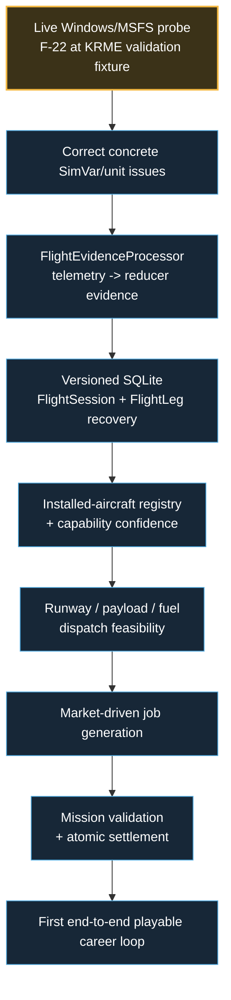

# OpenCareer master development checklist

Status: living project tracker.  
Last reconciled: 2026-09-19 with current integration branch plus military PR #10 status.

This is the master checklist for OpenCareer development. It is intentionally stricter than a feature wish list: an item is checked only when the implementation exists and the stated verification has actually been performed.

## How this stays live

Whenever a development change materially changes project status:

1. Update this checklist in the same branch/commit or immediately following documentation commit.
2. Update `docs/project-state.md` when the handoff/next bounded work changes.
3. Keep `ASTRA.md` short; it links here rather than duplicating the full tracker.
4. Never mark a live-MSFS acceptance item complete from mocks, synthetic traces, compilation or CI alone.
5. Never mark a gameplay system complete because its design document exists.
6. Preserve the existing chapter order unless an explicit project decision changes it.

Status words used in the graphics:

- **COMPLETE** — implementation and its stated verification are done.
- **ACTIVE** — useful implementation exists, but the chapter/track exit gate is not met.
- **GATED** — work is intentionally waiting on a prerequisite or real-world validation.
- **PLANNED** — accepted scope with no qualifying implementation yet.

## Development path

## Current critical path

---

# Chapter 1 — Project continuity and working rules

Chapter status: **COMPLETE**

- [x] Create canonical `AGENTS.md`.
- [x] Create ultra-fast `ASTRA.md` resume file.
- [x] Maintain detailed `docs/project-state.md`.
- [x] Establish feature-branch + draft-PR workflow.
- [x] Establish deterministic domain test foundation.
- [x] Establish chapter-based development workflow.
- [x] Create this master development tracker.
- [x] Preserve fixed architecture decisions: C#/.NET 10, WinUI 3, SimConnect boundary, SQLite, offline-first core.
- [x] Keep F-22/KRME explicitly documented as a developer validation fixture rather than a career-start asset.

Exit gate: repository documentation alone is sufficient for a fresh development chat to identify branch, architecture, implemented foundation, hard gates and next bounded work.

---

# Chapter 2 — Windows application shell

Chapter status: **ACTIVE**

## Implemented

- [x] Create `OpenCareer.App` with .NET 10 / WinUI 3 / Windows x64.
- [x] Add left `NavigationView` shell.
- [x] Add Dashboard page.
- [x] Add Current Flight page.
- [x] Add safe placeholders for later sections.
- [x] Separate Views/ViewModels from simulator/domain services.
- [x] Add application startup DI/logging foundation.
- [x] Display disconnected/waiting state without blocking the UI.
- [x] Display normalized live telemetry when supplied by the simulator service.
- [x] Ensure telemetry/connection state alone does not create a `FlightSession`.
- [x] Add Windows CI build for the WinUI app.
- [x] Define versioned full-product first-run tutorial behavior and copy in `docs/intro-tutorial.md`.

## Remaining

- [x] Implement tutorial catalog + feature-readiness boundary.
- [x] Implement WinUI first-run tutorial overlay with Back / Next / Skip / Finish.
- [x] Persist tutorial version/progress independently from authoritative career state.
- [x] Add Settings action to restart the intro tutorial.
- [ ] Add per-control spotlight/focus targets; page navigation and **Coming Later** readiness labels are implemented.
- [ ] Launch and inspect the production app locally on the user's Windows machine with MSFS closed.
- [ ] Verify NavigationView interaction locally.
- [ ] Verify resize/adaptive behavior on practical desktop window widths.
- [ ] Verify startup/shutdown behavior with the native SimConnect DLL present.
- [ ] Replace later placeholders only when their backing application/domain systems exist.

Exit gate: Windows launch/navigation/disconnected state verified locally; no startup crash.

---

# Chapter 3 — Simulator connection and normalized telemetry

Chapter status: **GATED — implementation exists, live runtime acceptance is open**

## Implemented

- [x] Create mockable `ISimulatorConnection` boundary.
- [x] Create mockable `ISimulatorTelemetrySource` boundary.
- [x] Isolate SDK/native calls in `OpenCareer.SimConnect`.
- [x] Serialize native SimConnect ownership on one worker.
- [x] Implement connect/disconnect handling.
- [x] Implement bounded retry/reconnect behavior.
- [x] Implement liveness checking.
- [x] Prevent false Connected state when SimConnect setup fails.
- [x] Normalize initial ~1 Hz telemetry.
- [x] Normalize latitude/longitude.
- [x] Normalize MSL/AGL altitude.
- [x] Normalize IAS / ground speed.
- [x] Normalize vertical speed.
- [x] Normalize heading.
- [x] Normalize pitch/bank/G.
- [x] Normalize on-ground / parking brake.
- [x] Normalize engine state.
- [x] Normalize fuel and conservative derived payload.
- [x] Normalize flaps / gear.
- [x] Normalize pause / slew.
- [x] Clear stale telemetry after the simulator connection/session ends.
- [x] Add raw callback / mapping / malformed packet tests.
- [x] Add Windows live-probe executable.
- [x] Add offline JSONL trace analyzer.
- [x] Add synthetic trace-analyzer tests.

## Remaining / live gate

- [x] Run `./tools/run-live-probe.ps1` with MSFS 2024 on the user's Windows machine.
- [x] Verify simulator absent -> Waiting/Disconnected.
- [x] Verify native connection to MSFS 2024.
- [ ] Verify actual installed aircraft identity behavior.
- [x] Capture ~1 Hz F-22/KRME telemetry; instrument-by-instrument acceptance remains open.
- [x] Capture pause / resume transitions.
- [x] Capture menus/loading transitions, including placeholder coordinates that must not become flight evidence.
- [x] Capture taxi values.
- [x] Capture takeoff values.
- [x] Capture climb/cruise values.
- [x] Capture approach/landing values.
- [ ] Verify normal simulator quit.
- [x] Verify simulator connection loss and retry after exit/loss.
- [x] Verify telemetry clearing after disconnect.
- [x] Verify reconnect after MSFS restart.
- [x] Correct observed gear-extension scale mismatch; live rerun verification remains required.
- [ ] Add verified simulation-rate capture.
- [ ] Add verified aircraft identity/title/type fields needed by the flight/session system.
- [ ] Add bounded/adaptive telemetry sampling needed for landing detection/scoring.

Exit gate: live Windows/MSFS connect-disconnect-reconnect and telemetry behavior demonstrated; missing-value handling remains covered by automated tests.

---

# Chapter 4 — Flight detection, time accounting and durable recovery

Chapter status: **ACTIVE FOUNDATION / GATED FOR CALIBRATION**

## Implemented foundation

- [x] Define accepted flight-session semantics in `docs/flight-session-design.md`.
- [x] Implement pure `FlightTrackingStateMachine` reducer foundation.
- [x] Keep raw SimConnect thresholds out of the pure reducer.
- [x] Implement `FlightTimeLedger`.
- [x] Separate simulated, block/movement, airborne and career-credit time concepts.
- [x] Account for pause/slew in the time model.
- [x] Define simulation-rate career-credit anti-exploit rule.
- [x] Define multi-leg `FlightSession` / `FlightLeg` behavior.
- [x] Define bounce/recontact vs new landing episode.
- [x] Define touch-and-go separately from full-stop.
- [x] Define rejected-takeoff behavior.
- [x] Define safe diversion/go-around semantics.
- [x] Define conventional park/shutdown/servicing terminal policy.
- [x] Add deterministic unit tests for the pure flight-core foundation.
- [x] Add offline trace analysis to support threshold calibration.

## Remaining

- [ ] Implement configurable `FlightEvidenceProcessor` from normalized telemetry/events.
- [ ] Calibrate speed/AGL/timing/hysteresis thresholds from real MSFS traces.
- [ ] Detect stable load/observation start.
- [ ] Detect self-powered movement / flight-time start.
- [ ] Detect taxi-out.
- [ ] Detect takeoff roll.
- [ ] Detect rejected takeoff.
- [ ] Detect sustained airborne state.
- [ ] Detect approach/landing episode.
- [ ] Detect bounce/recontact without duplicate landing.
- [ ] Detect go-around/new approach.
- [ ] Detect taxi-in.
- [ ] Detect parking/shutdown terminal conditions.
- [ ] Handle aircraft change safely.
- [ ] Handle material slew/teleport evidence.
- [ ] Handle disconnect suspension and plausible resume.
- [ ] Create authoritative runtime `FlightSession` orchestration.
- [ ] Create versioned SQLite schema for FlightSession/FlightLeg.
- [ ] Add atomic/checkpoint persistence.
- [ ] Add previous-valid-save/recovery strategy.
- [ ] Prevent duplicate milestones/rewards after resume.
- [ ] Persist decimated route track plus event windows.
- [ ] Verify recovery after app restart.
- [ ] Verify recovery after simulator disconnect/restart.
- [ ] Verify representative 1-, 3- and 6-hour replay scenarios.
- [ ] Verify at least one complete live takeoff-to-park/shutdown session.

Exit gate: a real session can be tracked, saved, interrupted, recovered and completed without duplicate effects.

---

# Chapter 5 — Installed-aircraft registry and feasible dispatch

Chapter status: **PLANNED, with domain capability foundations**

## Existing foundation

- [x] Establish capability-based eligibility direction; no small static supported-aircraft whitelist.
- [x] Define separate concepts for civilian ownership, rental/employer access and military assignment.
- [x] Establish performance-source/confidence policy.
- [x] Establish runway/performance feasibility requirement.

## Remaining

- [ ] Detect/index installed aircraft.
- [ ] Persist installed-aircraft registry.
- [ ] Normalize aircraft identity/family/type.
- [ ] Infer/store capability profiles.
- [ ] Record source/confidence per important capability.
- [ ] Resolve selected aircraft access type.
- [ ] Read/use simulator scenery/facility runway data where practical.
- [ ] Build airport/runway candidate model.
- [ ] Validate payload/weight.
- [ ] Validate fuel/endurance/range.
- [ ] Validate takeoff runway feasibility.
- [ ] Validate landing runway feasibility.
- [ ] Apply safety margins.
- [ ] Include weather/environment inputs where authoritative data exists.
- [ ] Reject unknown-critical-performance cases with explicit reason.
- [ ] Ensure military assignment eligibility cannot imply civilian ownership.
- [ ] Add deterministic capability/dispatch tests.

Exit gate: impossible or unknown-critical jobs are rejected before acceptance; feasible routes explain why they pass.

---

# Chapter 6 — Home airport, employment and first playable mission loop

Chapter status: **PLANNED, with contract/location foundations**

## Existing foundation

- [x] Create structured contract lifecycle foundation.
- [x] Add location/home-base connection rules.
- [x] Add travel-history guards.
- [x] Add typical session-duration preferences.
- [x] Define no-teleport company geography.
- [x] Define fresh-career start with no required owned aircraft.
- [x] Define employer/rental/assigned-aircraft path.

## Remaining

- [ ] Create player career onboarding.
- [ ] Home-airport selection.
- [ ] Persist player location/home base.
- [ ] Build market-driven job generation.
- [ ] Filter jobs through aircraft/runway/qualification feasibility.
- [ ] Build briefing flow.
- [ ] Build dispatch-to-active-mission flow.
- [ ] Bind mission evidence to FlightSession.
- [ ] Implement mission-specific objective validation.
- [ ] Require mission terminal conditions beyond landing.
- [ ] Build result/debrief flow.
  - [x] Define immutable FlightDebrief snapshot with separate flight-safety and mission outcomes.
  - [x] Preserve multi-leg hierarchy, decimated route track, time/experience, fuel, payload, assistance, landing and event evidence.
  - [x] Preserve evidence quality and unknown/unavailable values without fabrication.
  - [ ] Map authoritative completed FlightSession data into the debrief automatically.
- [ ] Add logbook commit flow.
  - [x] Implement idempotent application-level LogbookCommitCoordinator.
  - [x] Require final authoritative career settlement before automatic career log commit.
  - [x] Keep manual free/practice logging separate from contract settlement.
  - [x] Implement persistent versioned SQLite ILogbookSource / ILogbookWriter with indexed filters, immutable payload storage and idempotency.
  - [ ] Wire authoritative career settlement -> SQLite Logbook commit.
- [ ] Atomically settle money once.
- [ ] Atomically settle reputation/relationships once.
- [ ] Atomically settle travel/location once.
- [ ] Prevent duplicate settlement.
- [ ] Keep employee work viable without company ownership.
- [ ] Add first representative passenger/cargo/utility job.
- [ ] Add first end-to-end playable KRME-area career operation.

Exit gate: accept -> dispatch -> fly -> validate -> park/shutdown -> settle once -> reload.

---

# Chapter 7 — Persistent economy, named cargo, absence and recovery

Chapter status: **ACTIVE FOUNDATION**

## Implemented foundation

- [x] Deterministic world/economy simulation foundation.
- [x] Persistent market-state model.
- [x] Event/replay/checkpoint foundation.
- [x] Contract/economy invariants.
- [x] Protected-absence policy foundation.
- [x] Bankruptcy-stage/recovery policy foundation.
- [x] Session preference policy.
- [x] Bounded manual-ground reward quote model.
- [x] Define named-commodity cargo requirements.
- [x] Separate freight compensation from cargo value.
- [x] Define temporary shock vs structural-capacity distinction.

## Remaining

- [ ] Persist authoritative world/economy state in production SQLite.
- [ ] Connect world state to live job generation.
- [ ] Connect fuel/service/MRO/labor pressure to operating costs.
- [ ] Implement named commodity catalog.
- [ ] Implement immutable accepted cargo manifests.
- [ ] Implement airport/region commodity snapshots.
- [ ] Generate cargo jobs from supply/demand/event state.
- [ ] Implement cargo condition/outcome evidence only where supported.
- [ ] Settle cargo freight/penalties atomically.
- [ ] Implement long-absence advancement in authoritative career state.
- [ ] Verify no duplicate payments/debt effects after reload.
- [ ] Implement recoverable bankruptcy execution.
- [ ] Keep employee path available after financial failure.
- [ ] Balance world dynamics through deterministic simulations.

Exit gate: persistent world affects jobs/costs coherently and survives long absence/reload without duplicate effects.

---

# Chapter 8 — Credit, dealers, ownership and storage

Chapter status: **ACTIVE FOUNDATION**

## Implemented foundation

- [x] Career-derived credit model.
- [x] Fictional lender model.
- [x] Affordability/debt-service checks.
- [x] Fictional aircraft dealer model.
- [x] Seeded dealer offers/discounts.
- [x] Dealer stock validation.
- [x] Cash/finance eligibility quote foundation.
- [x] Define 50–80 real-flight-hour ownership balancing target without hard unlock.
- [x] Separate access/assignment from ownership.

## Remaining

- [ ] Persist lender/dealer state.
- [ ] Persist dealer inventory and used-aircraft condition.
- [ ] Add lender comparison UI.
- [ ] Add dealer/aircraft purchase UI.
- [ ] Atomically consume dealer stock.
- [ ] Atomically debit cash/deposit.
- [ ] Originate persistent loans.
- [ ] Transfer aircraft ownership atomically.
- [ ] Prevent duplicate purchase/loan creation.
- [ ] Implement repayment schedules.
- [ ] Implement default/restructuring behavior.
- [ ] Implement insurance integration.
- [ ] Implement hangar/storage availability and costs.
- [ ] Implement delivery/reposition logistics.
- [ ] Balance ownership pacing using settled career income/costs.

Exit gate: cash and financed aircraft purchases survive reload and cannot duplicate stock, money or loans.

---

# Chapter 9 — Maintenance, company growth, bases and route expansion

Chapter status: **FOUNDATION IN PROGRESS** — isolated `feature/mbl17-airframe-condition`; the frozen KJFK live-test candidate is unchanged.

- [x] Persist gradual wear separately from discrete damage, keyed by permanent physical AirframeId (schema 14 foundation; schema 15 adds consequence history).
- [x] Persist normalized first-contact landing telemetry with confirmed episode/bounce evidence in FlightSession checkpoints.
- [x] Retain canonical aircraft identity plus optional explicitly validated physical AirframeId on career FlightSessions; preserve model-only KJFK operation, legacy checkpoints and model-level reservations without condition mutation.
- [x] Apply confirmed-contact/crash consequences plus historical routine structural wear exactly once to explicitly assigned airframes; atomic condition/history, terminal cleanup retry and no-mutation non-crash interruption. Gameplay calibration still requires live validation.
- [x] Block explicit grounded physical assignments before career acceptance/reservation and recheck before InProgress/session creation; preserve model-only operation, exact identity and recoverable race state without wear thresholds.
- [x] Expose read-only physical-airframe condition/serviceability and validated immutable consequence history through bounded schema-15 indexed queries; retain original calibration/evidence and exact identity. Local history/regression tests pass; exact-head Windows results belong to PR #106.
- [ ] Use verified simulator wear/component state only where available.
- [ ] Add fallback OpenCareer reliability state.
- [ ] Implement component/service schedules.
- [ ] Implement repair/maintenance cost and downtime.
- [ ] Implement MRO/parts availability.
- [ ] Extend retained consequence history with future repair/service events and Maintenance UI.
- [ ] Connect hard-landing/abuse evidence to appropriate damage/wear logic.
- [ ] Keep routine management automated by default.
- [ ] Implement evidence-backed manual-ground actions with bounded one-time rewards.
- [ ] Persist airport relationships.
- [ ] Persist hangar/storage inventory.
- [ ] Implement additional bases.
- [ ] Implement route/network relationships.
- [ ] Add NPC employee/crew foundation.
- [ ] Prevent uncontrolled offline borrowing/spending.
- [ ] Expose operating margins/risks before expansion.

Exit gate: maintenance, staffing, facilities and geography affect availability/profit without bypassing safety or persistence rules.

---

# Chapter 10 — Military/government careers, simulated conflict and special events

Chapter status: **CAMPAIGN CORE COMPLETE — INTEGRATIONS / ACCEPTANCE PENDING ON PR #10; EXACT-HEAD LINUX/WINDOWS GREEN**

## Completed design/foundation

- [x] Keep government/military access distinct from ownership.
- [x] Define military-heavy airport weighting without inventing undocumented real operations.
- [x] Preserve KRME's civilian/government/defense-support/UAS character.
- [x] Define military/government UI destination.
- [x] Define Conflict Operations visual design.
- [x] Define fundamental combat boundary: MSFS supplies flight telemetry; OpenCareer simulates all combat/threat/damage/world effects.
- [x] Require fictionalized/abstracted conflict scenarios rather than recreating real tragedies as entertainment.
- [x] Existing world-event engine can provide deterministic event foundations.
- [x] Implement versioned deterministic conflict-world state.
- [x] Implement friendly/hostile/neutral ground-unit state with strength, readiness and pressure.
- [x] Implement geographic sector control and intelligence-confidence state.
- [x] Implement derived front-line snapshot from contested sector state.
- [x] Implement friendly/hostile simulated air units with deterministic movement.
- [x] Implement air-defense and interceptor threat envelopes linked to simulated source units.
- [x] Generate CAS and suppression support requests from simulated battlefield pressure.
- [x] Generate reconnaissance, logistics and patrol requests from intelligence/readiness/control state.
- [x] Generate escort/intercept requests from simulated air activity.
- [x] Reserve/close support requests so one active request cannot be accepted twice.
- [x] Implement CAS/suppression accept -> ingress -> on-station -> authorized action -> egress -> objective-complete lifecycle.
- [x] Implement reconnaissance, logistics and patrol telemetry-driven objective lifecycles.
- [x] Implement escort and intercept telemetry-driven objective lifecycles.
- [x] Validate mission windows from normalized player telemetry while rejecting pause/slew and invalid on-ground/airborne conditions.
- [x] Implement abstract precision/suppression/recon effects entirely inside OpenCareer.
- [x] Implement abstract intercept effects entirely inside OpenCareer.
- [x] Implement player threat exposure from normalized telemetry.
- [x] Implement deterministic simulated threat resolution and OpenCareer-only aircraft-damage state.
- [x] Feed mission effects back into unit strength/readiness, sector control/intelligence and linked threat severity.
- [x] Implement military affiliation, qualification and assigned-aircraft authorization policy.
- [x] Ensure installed/owned military-capable aircraft alone never grants military mission access.
- [x] Implement bounded military trust/progression result updates.
- [x] Add explicit operation-resolution input/outcome contracts with deterministic Success / PartialSuccess / Failure / Aborted resolution.
- [x] Add stable operation-resolution keys and duplicate-completion protection.
- [x] Add deterministic faction influence, campaign progress, thresholded territory pressure, military reputation and conflict-resource consequences.
- [x] Add application-layer consequence orchestration that produces one validated immutable result.
- [x] Persist immutable operation outcomes + applied consequence state in SQLite schema v5 with restart-safe duplicate rejection.
- [x] Add failure compensation/transaction behavior so failed consequence persistence is retryable and cannot double-apply state.
- [x] Verify reconnect/replay safety so repeated completed-flight events do not reapply campaign, territory, reputation or resource effects.
- [x] Add end-to-end integration coverage for success, partial success, failure, abort, invalid mission, already-resolved mission, SQLite restart and rollback/retry.
- [x] Implement seeded fictional theater generation with repeatable ground/air units, sectors and threats.
- [x] Implement versioned campaign checkpoints for world, military career, simulated player damage and active mission state.
- [x] Persist conflict campaigns in the shared SQLite database with schema migration and optimistic revision protection.
- [x] Restore reserved support requests and active mission state from a persisted checkpoint without duplicating mission ownership.
- [x] Persist mission-stage progress and simulated threat outcomes so restart recovery does not replay damage/effects.
- [x] Implement strategic campaign phase, momentum and deterministic objectives for control, intelligence, readiness and threat reduction.
- [x] Coordinate world advancement and strategic-state persistence through `ConflictCampaignCoordinator`.
- [x] Enforce military authorization at the dispatch/acceptance boundary so lower-level mission services cannot bypass qualification/assignment rules.
- [x] Project campaign/front/threat/support/active-operation data through an application snapshot for the future Military/Government UI.
- [x] Add deterministic xUnit coverage for ground conflict, air conflict, request lifecycle, mission lifecycles, qualification policy, theater generation, SQLite recovery, campaign evolution and dispatch authorization.
- [x] Document the conflict/MSFS boundary in `docs/conflict-system.md`.

Verification note: campaign-core implementation head `16cda14981bc6284e4f33833e88aa8289ff46149` is green in exact-head Linux PR CI and exact-head Windows CI. This boundary includes production mission-service consequence wiring, deterministic phase-driven faction-posture evolution, legacy-identity evolution coverage, and the bounded 96-step deterministic campaign evolution stress test.

## Remaining

**Campaign-core completion boundary:** reached at `16cda14981bc6284e4f33833e88aa8289ff46149`. No additional standalone campaign mechanic slice is queued. Remaining unchecked work below is dependency-driven integration, product acceptance, or later balance/live-runtime validation.

- [x] Wire automatic production startup/resume so app startup recovers the most recently saved military conflict campaign without a manual orchestration call.
- [x] Add database-consistent backup snapshot integration for conflict campaign checkpoints using SQLite backup semantics rather than copying the live WAL database files.
- [x] Add validated restore integration from an OpenCareer backup archive: stage and integrity-check the SQLite image first, then apply it on restart before SQLite-backed state is recovered, with rollback protection.
- [ ] Expose backup selection/confirmation in Settings so the validated restore backend is user-accessible without manual/internal invocation.
- [x] Add deterministic fictional operation identity and distinct friendly/hostile faction names/short codes while keeping the underlying simulation sides generic and reusable.
- [x] Add the first bounded long-term campaign-cycle layer: nearby logistics recovery for ground units, theater-logistics air readiness recovery, momentum-based sector consolidation and linked-threat resynchronization.
- [x] Add finite replacement reserves for both sides; replacements require operational logistics, reinforce surviving damaged ground units deterministically and consume the reserve.
- [x] Add persisted campaign outcomes: Victory, Defeat, Stalemate and Ceasefire, with sustained-secured, mutual-exhaustion and prolonged-balanced-state rules.
- [x] Prevent telemetry-only mission progress saves from incrementing campaign evaluation counters and prevent new military mission acceptance after a terminal campaign outcome.
- [x] Add successor-campaign transition after terminal outcomes while preserving military career state, simulated player damage and a persistent completed-operation history chain.
- [x] Add deterministic successor-operation offer planning across fictional theater candidates, avoiding an immediate theater repeat when alternatives exist and previewing the exact operation identity acceptance will create.
- [x] Add an application-layer successor-operation flow with `IConflictTheaterCatalog`, offer projection, accept/decline/reconsider actions, stale-offer rejection and runtime-state replacement after acceptance.
- [x] Persist completed-operation history through SQLite and expose it in the Military/Government operations snapshot.
- [x] Display read-only archived operation history in Military/Government, with deterministic newest-first ordering, empty/reset states and SQLite recovery coverage.
- [x] Add completed-operation drill-down selection/detail UX: campaign-ID-stable selection across polling/current-campaign replacement/successor activation, safe stale-history clearing, persisted terminal posture projection, native keyboard/focus behavior, long-text handling and read-only archive labeling.
- [x] Verify completed-operation drill-down across real SQLite restart with exact field fidelity and a before/after `conflict_campaigns` fingerprint proving select/refresh/clear/reselect performs no database writes (`018e1da5`; Linux 402/402 xUnit + 29/29 SimLab; latest production Windows head `555b9dc7` WinUI/LiveProbe 0 errors + 402/402 xUnit).
- [x] Add deterministic faction operational posture (Defensive / Aggressive / LogisticsFocused / AirFocused) and use it to bias replacement priority plus support-request thresholds/urgency/range without making AI authoritative.
- [x] Add the user-facing Military/Government successor-operation presentation with Accept / Decline / Reconsider routed through the application transition service.
- [x] Verify successor UI storage-failure/cancellation recovery, stable action feedback, stale-campaign refresh, duplicate-click protection and SQLite successor recovery at `4c63e365` in Linux/Windows CI; local MSBuild execution was blocked by workspace socket restrictions.
- [x] Add deterministic faction-posture evolution across campaign phase transitions while preserving terminal/outcome posture semantics.
- [ ] Integrate military authorization with authoritative player-career persistence/onboarding.
- [x] Wire `PersistedOperationConsequenceCoordinator` into `MilitaryCampaignMissionService` completion/failure and replace the legacy direct `MilitaryCareerProgression.RecordOperationResult` update so reputation cannot be awarded twice.
- [ ] Integrate conflict outcomes with authoritative mission/job settlement without allowing battle logic to pay money directly.
- [ ] Add aircraft assignment issuance/revocation to the fleet/dispatch system.
- [x] Implement the first production Military/Government WinUI screen against conflict application snapshots/services; it shows campaign/faction/posture/outcome/reserve/front/support/objective state without UI-owned game logic.
- [x] Add read-only completed-operation history, schematic Operational Map and deterministic Communications feed to Conflict Operations without UI-owned conflict authority.
- [ ] Expand Conflict Operations UI with deeper drill-down and complete local visual/accessibility acceptance.
- [x] Add bounded deterministic long-run campaign evolution stress coverage with replay equality and invariant checks (`16cda14981bc6284e4f33833e88aa8289ff46149`).
- [ ] Add large deterministic campaign balance/playtesting batches for later tuning.
- [x] Record Linux + Windows validation for code head `b4e3ca81`: 376/376 xUnit on both, 29/29 SimLab on Linux, WinUI/live-probe builds at 0 errors on Windows.
- [ ] Run gameplay tuning so conflict does not dominate civilian careers or produce repetitive support spam.
- [ ] Verify representative conflict missions against live normalized MSFS telemetry after the flight-evidence/runtime gate is ready.

Exit gate: distinct military/government mission families have deterministic validation, authorization filters, persistent simulated consequences, verified tests and no dependency on nonexistent MSFS combat APIs.
---

# Chapter 11 — Balance, performance, packaging and release readiness

Chapter status: **PLANNED / CONTINUOUS**

## Existing verification foundation

- [x] xUnit test suite established.
- [x] Deterministic SimLab scenarios established.
- [x] Windows CI established.
- [x] Linux domain/test CI established.
- [x] Current verified baseline at implementation commit `540029c`: 104/104 xUnit + 29/29 SimLab; Windows WinUI/probe build green.
- [x] Offline trace-analyzer validation exists.
- [x] UI design system and screen specification exist.

## Remaining

- [ ] Keep CI green as new vertical slices land.
- [ ] Run representative 1-hour missions.
- [ ] Run representative 3-hour missions.
- [ ] Run representative 6-hour missions.
- [ ] Test long absence/recovery.
- [ ] Test strong/ordinary/struggling economy progression.
- [ ] Test ownership pacing.
- [ ] Test exploit loops.
- [ ] Profile CPU usage beside MSFS.
- [ ] Profile memory usage beside MSFS.
- [ ] Profile telemetry queues.
- [ ] Profile SQLite writes.
- [ ] Verify UI responsiveness during live flight.
- [ ] Test installation/packaging.
- [ ] Test upgrades/migrations.
- [ ] Test backup/recovery.
- [ ] Validate useful user-facing failure messages.
- [ ] Perform gameplay/playability passes.
- [ ] Validate repetitive-job variety.
- [ ] Validate meaningful airport/base decisions.
- [ ] Validate employee-only career viability.
- [ ] Complete Windows/MSFS acceptance evidence.
- [ ] Resolve critical save/settlement defects.
- [ ] Create release packaging/signing/update strategy.

Exit gate: documented Windows/MSFS evidence, stable persistence/settlement, measured runtime impact and a playable progression loop.

---

# Cross-cutting track — UI/product implementation

Track status: **DESIGN COMPLETE / IMPLEMENTATION PARTIAL**

- [x] Create UI visual direction.
- [x] Create canonical UI design system.
- [x] Lock canonical retro-modern UI design language in `docs/ui-design-language.md`.
- [x] Implement centralized Jet Age WinUI design tokens in `Styles/DesignTokens.xaml`.
- [x] Implement reusable typography/panel/button/status styles in `Styles/ComponentStyles.xaml`.
- [x] Add reusable form-control, toggle, tab, list and ledger/table styles.
- [x] Preserve native WinUI control templates/focus behavior instead of replacing accessibility-critical templates.
- [x] Add design-system contract tests for canonical colors, contrast, required style keys and duplicate resources.
- [x] Migrate current Dashboard, Current Flight, Settings, placeholder, shell and tutorial surfaces onto shared design resources.
- [ ] Verify shared resource dictionaries in Windows WinUI CI and local application launch.
- [x] Verify canonical text/background contrast mathematically in automated design-system contract tests.
- [ ] Verify keyboard focus, high-contrast behavior and text scaling interactively with the production resource system.
- [x] Define all 15 current navigation destinations.
- [x] Create dashboard concept.
- [x] Create all-tab screen atlas.
- [x] Create Conflict Operations reference.
- [x] Preserve same shell/design language during conflict mode.
- [x] Define adaptive-layout/accessibility rules.
- [x] Implement production shell.
- [x] Implement initial Dashboard.
- [x] Implement production Dashboard layout and data contract without fabricated career/job/economy values.
- [x] Implement deterministic dynamic Dashboard guidance/routing foundation.
- [x] Implement Top Opportunities selection: four highest available jobs by tier -> fit -> economics/reposition tie-breakers.
- [x] Lock opportunity tiers: Green Standard / Blue Specialist / Purple Elite / Orange-Gold Legendary with text labels.
- [x] Add career/company/finance/aircraft/world/recent-activity/social-feed Dashboard modules.
- [x] Add searchable OpenCareer Network in-world social-feed surface.
- [x] Remove KRME as a hard-coded production Home base; keep it developer-fixture only.
- [ ] Wire Dashboard to authoritative Jobs/Career/Company/Aircraft/Economy/World snapshot sources as those systems are implemented.
- [ ] Verify production Dashboard adaptive layout, keyboard navigation and visual hierarchy on Windows.
- [x] Implement initial Current Flight telemetry page.
- [x] Define per-flight contextual checklist UX with inline controller/keyboard binding state.
- [x] Define layered onboarding: app tutorial, first-job tutorial and first-time mission-family tutorials.
- [x] Define mission-family tutorial behavior for unique procedures in `docs/mission-tutorial-system.md`.
- [x] Implement shared versioned tutorial catalog + progress store with app intro, first-job, banner-tow and carrier-operation definitions.
- [ ] Require a tutorial definition before a specialized mission family is considered production-ready.
- [ ] Bind banner-tow and carrier takeoff/landing tutorials automatically to first mission use and live mission/checklist evidence when those mission families are built.
- [ ] Implement per-flight checklist phases; the persistent **Show checklist every flight** setting is implemented and ready for MBL-04 consumption.
- [ ] Implement controller/keyboard binding resolution/profile source without guessed bindings.
- [ ] Render missing controller/keyboard mappings as visible amber/orange **UNBOUND** and required/critical missing mappings as red **UNBOUND — REQUIRED**.
- [ ] Implement Dispatch screen against real dispatch services.
- [ ] Implement Jobs screen against real job services.
- [ ] Implement Map / World screen against real world state.
- [ ] Implement Aircraft screen against registry.
- [ ] Implement Hangar / Bases screen.
- [ ] Implement Maintenance screen.
- [ ] Implement Company screen.
- [ ] Implement employer rank/standing lifecycle with deterministic probation, demotion, suspension and firing/termination plus recovery/rehire rules.
- [ ] Implement Finances screen.
- [ ] Implement Markets screen.
- [x] Implement first Military / Government screen using the production design system and application-layer conflict projections/actions.
- [x] Add a read-only schematic Operational Map to Military/Government using existing conflict snapshot units/threats/support targets, with accessible text/automation labels and no UI-owned conflict rules.
- [x] Add deterministic Communications panel from current campaign/support/threat/active-operation snapshot state; no AI or fabricated event history.
- [ ] Complete local visual/accessibility acceptance of the Military/Government history/drill-down and surrounding operational surface.
- [x] Implement production Logbook / Debrief screen with committed-flight list, aggregate totals, filters, multi-leg detail, route-track rendering, landing evidence, incidents and settlement summary.
- [ ] Implement Career screen.
- [x] Implement production Settings screen.
- [x] Persist versioned app preferences independently from career state.
- [x] Implement Aviation/Metric unit selection and reformat existing telemetry without waiting for a new sample.
- [x] Implement live simulator/SimConnect/telemetry diagnostics.
- [x] Implement local application file logging.
- [x] Implement diagnostic ZIP export with coordinates excluded.
- [x] Implement current local-data ZIP backup and folder access.
- [x] Implement reduced-motion and offline optional-service permission preferences.
- [x] Keep real binding discovery explicitly owned by MBL-05.
- [x] Keep authoritative SQLite FlightSession/save recovery explicitly owned by MBL-07.
- [ ] Verify Settings persistence, backup/export and diagnostics interactively on Windows.
- [ ] Verify keyboard navigation/text scaling.
- [ ] Verify adaptive layouts.
- [ ] Verify live-flight UI refresh cost beside MSFS.

---

# Cross-cutting track — Optional real-world aviation data

Track status: **PLANNED**

These services are optional enrichment only. They must never become authoritative for player telemetry, career progression, mission completion, money, ownership, conflict outcomes or core offline gameplay.

## Provider abstraction

- [ ] Define `IAviationTrafficProvider` for live external aircraft state.
- [ ] Define `ICommercialFlightDataProvider` for schedules/route context.
- [ ] Define normalized external aircraft/flight models.
- [ ] Add caching and request throttling.
- [ ] Add provider health/fallback state.
- [ ] Store API credentials outside Git.
- [ ] Make every provider explicitly optional.
- [ ] Keep OpenCareer fully usable with all providers disabled.

## OpenSky

- [ ] Add OpenSky provider using `/api/states/all`.
- [ ] Prefer bounded geographic requests rather than global polling.
- [ ] Support anonymous mode where appropriate.
- [ ] Support OAuth2 client credentials only if needed.
- [ ] Respect credit/rate limits.
- [ ] Review licensing before any commercial distribution.
- [ ] Clearly label OpenSky-derived traffic as external real-world traffic.

## AirLabs

- [ ] Add AirLabs provider if credentials/plan justify it.
- [ ] Use filtered fields/areas to control request volume.
- [ ] Normalize live flight/route data.
- [ ] Keep key local and out of source control.

## FlightLabs / GoFlightLabs

- [ ] Add FlightLabs provider if credentials/plan justify it.
- [ ] Normalize airline/schedule/route enrichment.
- [ ] Keep key local and out of source control.
- [ ] Validate cost/request cadence before enabling background use.

## SerpApi / Google Flights

- [ ] Add commercial schedule/route-data adapter only if still useful after AirLabs/FlightLabs evaluation.
- [ ] Use it for route/schedule context, not player telemetry.
- [ ] Do not allow ticket price directly to determine OpenCareer payouts.
- [ ] Keep API key local and optional.

## Product integration

- [ ] Add external live-traffic layer to Map / World.
- [ ] Keep external traffic visually distinct from simulator traffic.
- [ ] Use external schedules only as bounded demand/context inputs.
- [ ] Deduplicate overlapping provider observations where possible.
- [ ] Gracefully degrade on quota/network/provider failure.

---

# Cross-cutting track — EFB / in-sim companion

Track status: **DESIGN COMPLETE / IMPLEMENTATION PLANNED**

- [x] Define thin EFB architecture.
- [x] Keep Windows application authoritative.
- [x] Define CommBus JSON bridge direction.
- [x] Keep .PLN fallback concept.
- [x] Require official MSFS Project Editor/Package Tool for package build.
- [ ] Build minimal EFB package.
- [ ] Implement event-driven bridge.
- [ ] Validate current MSFS 2024 EFB runtime behavior.
- [ ] Validate route synchronization.
- [ ] Validate .PLN fallback.
- [ ] Keep EFB optional.

---

# MVP acceptance checklist

The first end-to-end playable foundation is not complete until every item below is checked.

- [x] App project exists.
- [x] App can represent Waiting/Disconnected state.
- [x] SimConnect boundary is isolated/mockable.
- [x] Connection/reconnect implementation exists.
- [x] Core normalized telemetry implementation exists.
- [x] Deterministic world/economy simulation can run independently of MSFS.
- [ ] Production app launch verified locally with MSFS not running.
- [ ] Live MSFS connection verified.
- [ ] Live reconnect after MSFS restart verified.
- [ ] Current aircraft identity verified.
- [ ] Live core telemetry verified.
- [ ] Robust flight-state detection works from calibrated evidence.
- [ ] Active FlightSession orchestration works.
- [ ] FlightSession saves to SQLite.
- [ ] Interrupted FlightSession recovers safely.
- [ ] Basic flight completes from start through parking/shutdown.
- [ ] Completed flight is saved to logbook/history.
- [ ] At least one feasible job can be accepted and settled exactly once.

---

# Immediate next bounded work

Do not skip this order without an explicit reason:

1. Run the real Windows/MSFS live probe.
2. Analyze the JSONL trace.
3. Correct only concrete simulator-variable/unit/runtime discrepancies.
4. Implement configurable `FlightEvidenceProcessor`.
5. Add versioned SQLite FlightSession/FlightLeg checkpoint/recovery.
6. Build installed-aircraft registry and runway/dispatch feasibility.
7. Build the first market-driven playable job and atomic settlement.

The external aviation APIs, full conflict simulation, dealer expansion and rich production UI are valuable, but they do not replace this critical path.
