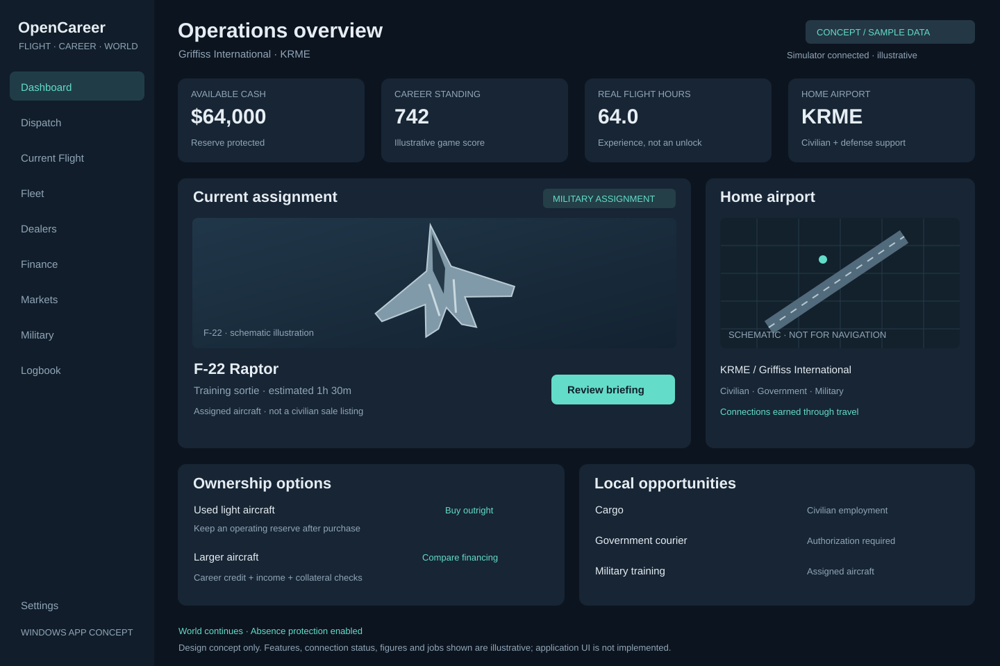

# OpenCareer visual concept

Concept only: the production UI is not implemented. All balances, scores, flight hours, jobs and connection indicators are sample data. The airport diagram is schematic, not a navigation map.

## Intended layout

- WinUI 3 desktop shell with left navigation and a persistent connection indicator.
- Dashboard summarizes cash, career standing, real flight hours and home airport.
- Current assignment distinguishes the military-assigned F-22 from civilian aircraft for sale.
- Home airport, local opportunities and ownership choices connect flying to career decisions.
- Restrained navy/slate surfaces, teal accents, readable type and generous spacing.

Chapter 2 implements the shell and disconnected/empty states first. The populated dashboard is a later target, not the first chapter's acceptance requirement. No sample numbers should become production constants.

## Efficient reading

Routine coding tasks read AGENTS.md and project-state.md, then relevant source only. Open this document and the image only for UI/design work. Do not load SVG source or image pixels into every chat. The brief describes intent; AGENTS.md remains authoritative.

Source asset: [scalable SVG](assets/opencareer-dashboard-concept.svg). Created directly as an editable vector mockup after Higgsfield generation was unavailable on the connected plan.
