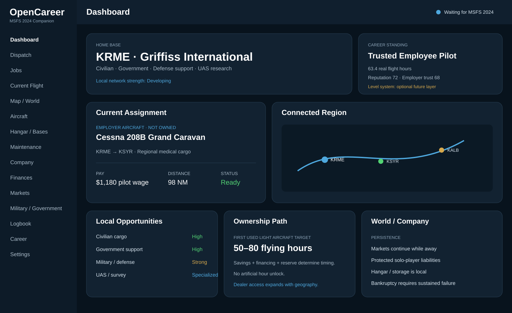

# OpenCareer visual concept

> Canonical implementation guidance now lives in [UI design system](ui-design-system.md) and [screen specification](ui-screen-spec.md). The [screen atlas](assets/opencareer-ui-screen-atlas.svg) shows the complete current navigation set; the [Conflict Operations reference](assets/opencareer-conflict-operations.svg) captures the approved in-war composition.

Concept only: the production UI is only beginning with the Chapter 2 shell. All balances, hours, jobs and aircraft shown in the concept are illustrative. The region map is schematic and not for navigation.

## Visual direction

OpenCareer should feel like a modern aviation operations/business terminal rather than an MMO launcher or developer utility.

- WinUI 3 desktop shell with left `NavigationView` and a persistent simulator-connection indicator.
- Dark navy/slate surfaces with restrained blue/teal accents.
- Home base is prominent because geography, local relationships, storage and airport economics matter.
- Current assignment clearly distinguishes **employer/rented/assigned** aircraft from aircraft actually owned by the player.
- Local jobs, military/government opportunities, route connections and expansion are visible without exposing every simulation variable.
- Finance cards emphasize useful obligations such as loans, insurance, maintenance reserve and hangar/storage rather than arcade-style currency spam.
- The live-flight screen becomes simpler than the management dashboard so OpenCareer does minimal UI work while MSFS is rendering.

## Progression and possible levels

The core progression remains qualifications, licenses/ratings, reputation, employer/customer trust, geography, finances and aircraft access.

A **career level system may be added later** because an additional long-term grind can be fun, but levels must have meaning. A level must never bypass a required license/rating, military authorization, aircraft capability, financial affordability or dispatch rule.

Good uses for future levels include:

- summarizing overall career experience,
- unlocking broader job-board visibility or convenience features,
- cosmetic/profile milestones,
- modest negotiation or employer-interest bonuses,
- gating optional prestige tracks only when the underlying real requirements are also met.

Avoid meaningless XP inflation or making levels the authority for mission completion, money, aircraft ownership or safety-critical eligibility.

## Chapter 2 implementation target

The first real UI is deliberately smaller than the full concept:

1. application launches without MSFS,
2. left navigation shell renders,
3. status shows `Waiting for MSFS 2024` / disconnected,
4. Dashboard shows the KRME home-base placeholder and connection state,
5. Current Flight shows a safe empty state,
6. unfinished sections remain visible placeholders rather than fake implementations.

The next implementation step is the isolated SimConnect connection/reconnect boundary. The rich populated dashboard comes later as real application data exists.

## Efficient reading

Routine coding chats should read `AGENTS.md` and `docs/project-state.md` first, then only the source files needed for the task. Read this file and the SVG only for UI/design work. Do not load image pixels or SVG source during unrelated domain work.

Visual assets:

- [current refined dashboard SVG](assets/opencareer-dashboard-concept-v2.svg)
- [complete UI screen atlas](assets/opencareer-ui-screen-atlas.svg)
- [Conflict Operations reference](assets/opencareer-conflict-operations.svg)
- [earlier SVG concept](assets/opencareer-dashboard-concept.svg)

The approved conflict look is a state of the same OpenCareer shell, not a separate product. Military / Government owns the full Conflict Operations workspace; Current Flight may show a compact conflict strip during an accepted conflict mission. MSFS provides flight telemetry only; OpenCareer owns all simulated combat/threat/effect state.
